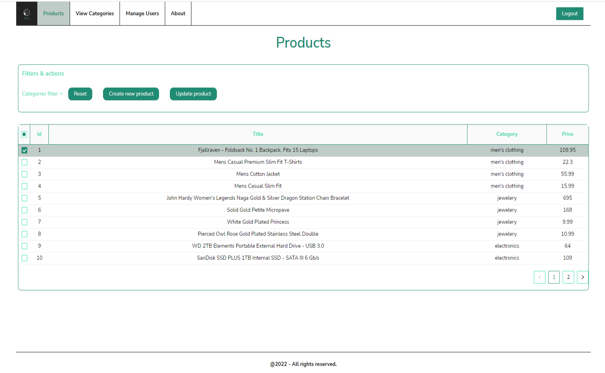

**_ Product Management App _**

Product Management App is a SPA (Single Page Application) built in React that will have the following functionalities:
-Routing (React Router v6)
-Authentication
-Pagination
-Filters & sorting
-Create new product
-Update product
-Delete product
This is a CRUD APP. A CRUD app is a specific type of software application that consists of four basic operations; Create, Read, Update, Delete.
The Product Management application was built using a fake API and it's not going to make any changes in the database.
FakeStoreApi is a free online REST API that you can use whenever you need Pseudo-real data for your e-commerce or shopping website without running any server-side code. It's awesome for teaching purposes, sample codes, tests, etc.
To build the app I have used Ant Design UI Kit.
Also I have used Github Issues (as a Jira story) to organize and created separate branch for each feature.

## Available Scripts

In the project directory, you can run:

### `npm start`

Runs the app in the development mode.\
Open [http://localhost:3000](http://localhost:3000) to view it in the browser.

The page will reload if you make edits.\
You will also see any lint errors in the console.

### `npm test`

Launches the test runner in the interactive watch mode.\

### `npm run build`

Builds the app for production to the `build` folder.\
It correctly bundles React in production mode and optimizes the build for the best performance.

The build is minified and the filenames include the hashes.\
Your app is ready to be deployed!
